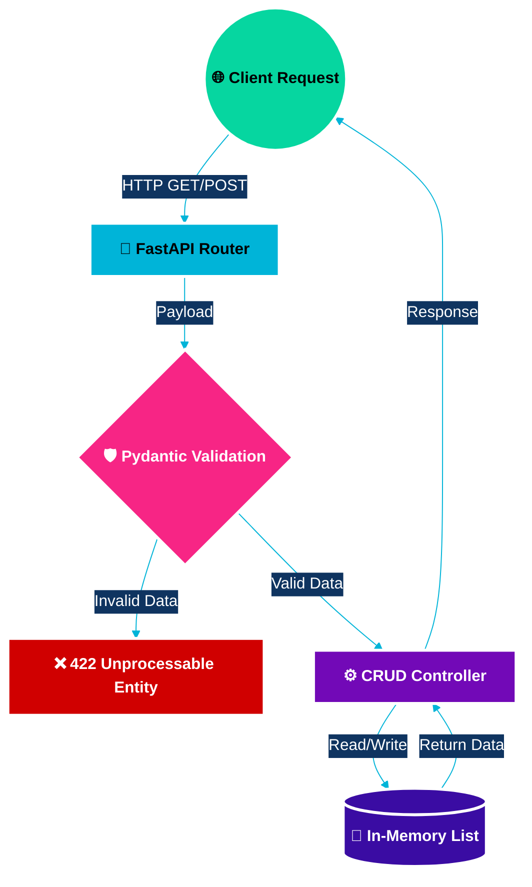

<div align="center">
  <h3>🎓 NexusEdu SIS & Architecture Visualization</h3>
  <p><i>A sleek, in-memory RESTful CRUD API demonstrating modern Python backend patterns.</i></p>

  <p>
    <a href="https://fastapi.tiangolo.com"></a>
    <a href="https://www.python.org"></a>
    <a href="https://pydantic-docs.helpmanual.io/"></a>
    <a href="https://graphviz.org/"></a>
  </p>
</div>

---

## 📌 About The Project

While minimalist in code, this **NexusEdu SIS** is engineered using professional-grade tools. It provides a robust backend foundation showing how to properly structure routing, request validation, and data serialization. 

With the integration of **Graphviz** as a conceptual architecture mapping tool, this project serves not only as an API backend but as an architectural blueprint for modern data-flow design.

## 🕸️ System Architecture (Graphviz / Flow Representation)

The following diagram illustrates the internal flow of request handling, from the client through the validation layer and into our in-memory data store.



## 🛠️ Architecture Highlights

- **No-Database Setup**: Uses in-memory state mapping for instant feedback and zero configuration overhead.
- **Graphviz Ready**: Designed with clear entity separations, making it trivial to export schemas and data graphs using Graphviz algorithms.
- **Strict Typing**: All endpoints use **Pydantic** to guarantee that invalid payloads are rejected automatically with helpful error messages.
- **Automatic Docs**: Compliant with OpenAPI standards, instantly generating a Swagger UI dashboard.

---

## 🚦 Getting Started

### Prerequisites

Ensure you have Python installed, along with the optional Graphviz engine if you plan to render local `.dot` files.

### Installation

Navigate to the directory and install the lightweight dependencies:

```bash
pip install fastapi "uvicorn[standard]"
```

### Running the Application

Spin up the local development server with hot-reloading enabled:

```bash
py -m uvicorn crud:app --reload
```
*(If `py` is unrecognized on your terminal, substitute it with `python`)*

The server will start listening at `http://127.0.0.1:8000`.

---

## 📖 API Documentation

Once the server is running, you can interact with the API entirely through the browser!

👉 **[Launch Interactive Swagger UI](http://127.0.0.1:8000/docs)**<br>
👉 **[Launch ReDoc View](http://127.0.0.1:8000/redoc)**

### Available Endpoints

| Method | Route | Description |
| :--- | :--- | :--- |
| `POST` | `/students` | Insert a new student record |
| `GET` | `/students` | Retrieve a list of all students |
| `GET` | `/students/{student_id}` | Fetch details for a specific student |
| `PUT` | `/students/{student_id}` | Update an existing student's data |
| `DELETE` | `/students/{student_id}` | Remove a student from the registry |

---

## 📦 Data Schema (Entity Representation)

All endpoints communicating student data adhere to the following strict JSON schema:

```json
{
  "id": 90,
  "name": "Santhosh",
  "age": 22,
  "course": "AWS Cloud Architecture & Engineering"
}
```

---
<div align="center">
  <small>Engineered with FastAPI & Graphviz Architecture. 🚀</small>
</div>