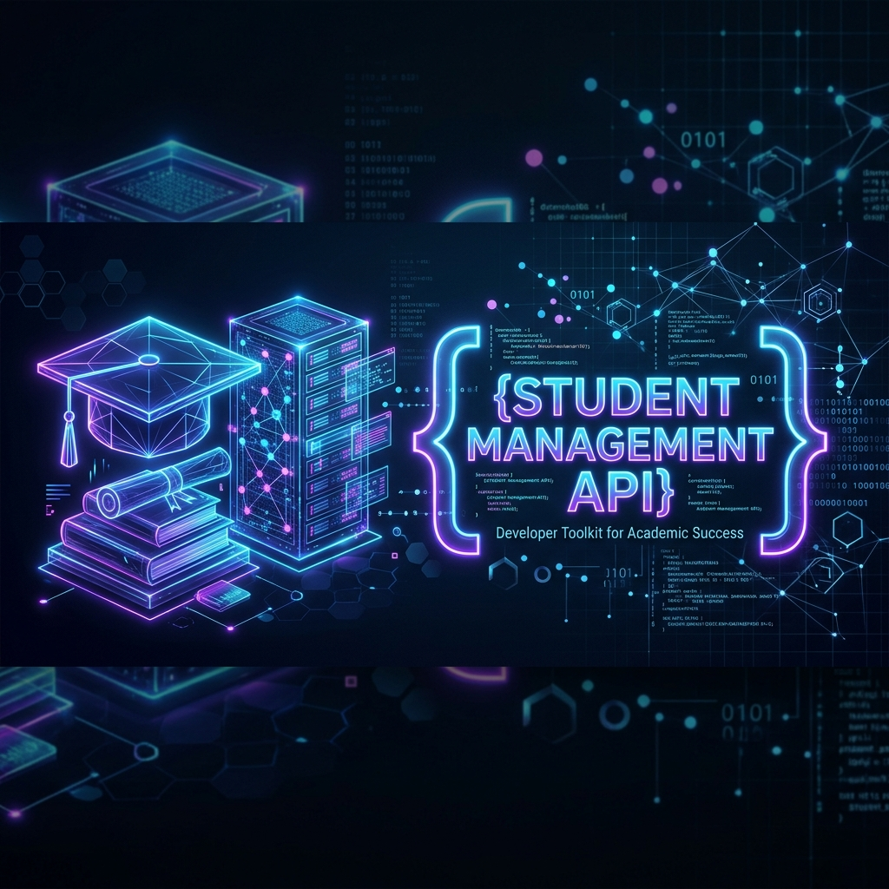

<div align="center">
  
  <br/>
  <h1>🎓 FastStudent API</h1>
  <p><strong>A Blazing-Fast, Modern, and Lightweight Student Management System</strong></p>

  <p>
    
    
    
    
  </p>
</div>

<br/>

## 🌟 Overview

Welcome to **FastStudent API**! This project is a minimalist yet powerful RESTful service built with modern Python technologies. It demonstrates how to rapidly develop a clean, asynchronous backend with out-of-the-box data validation and interactive documentation.

Whether you're a beginner learning API development or a seasoned dev looking for a quick CRUD template, this project serves as a perfect foundation.

## ✨ Why This Project?

- ⚡ **Blazing Fast:** Built on **FastAPI**, one of the highest performing Python web frameworks available.
- 🛡️ **Bulletproof Validation:** Leverages **Pydantic** for strict type hinting and automatic request validation.
- 📖 **Self-Documenting:** Automatic Swagger UI (`/docs`) and ReDoc (`/redoc`) integration. No more writing manual API specs!
- 🪶 **Zero Config:** Uses in-memory data structures. Clone, run, and test instantly without setting up databases.

---

## 🚀 Quickstart Guide

Get up and running in under 2 minutes.

### 1. Requirements
- Python 3.8+

### 2. Installation
Install the required dependencies via pip:
```bash
pip install fastapi "uvicorn[standard]"
```

### 3. Launch the Server
Start the Uvicorn ASGI server with hot-reloading enabled:
```bash
py -m uvicorn crud:app --reload
```
> **Tip:** If `py` is not recognized, simply use `python -m uvicorn crud:app --reload`.

### 4. Interactive Testing
Navigate to your browser to see the magic:
👉 **[http://127.0.0.1:8000/docs](http://127.0.0.1:8000/docs)**

---

## 📡 API Reference

A fully RESTful routing structure for student data operations.

| Action | Method | Endpoint | Description |
| :--- | :---: | :--- | :--- |
| **Create** | <kbd>POST</kbd> | `/students` | Register a new student in the system. |
| **Read All** | <kbd>GET</kbd> | `/students` | Fetch a list of all registered students. |
| **Read One**| <kbd>GET</kbd> | `/students/{id}` | Retrieve details of a specific student by their ID. |
| **Update** | <kbd>PUT</kbd> | `/students/{id}` | Modify an existing student's data. |
| **Delete** | <kbd>DELETE</kbd> | `/students/{id}` | Remove a student from the system entirely. |

---

## 🗃️ Data Schema

The system ensures robust data integrity using the following Pydantic `Student` model:

```json
{
  "id": 1,
  "name": "Alex Mercer",
  "age": 21,
  "course": "Advanced AI & Machine Learning"
}
```

---

<div align="center">
  <p><i>Crafted with passion using modern Python. 🐍 </i></p>
</div>